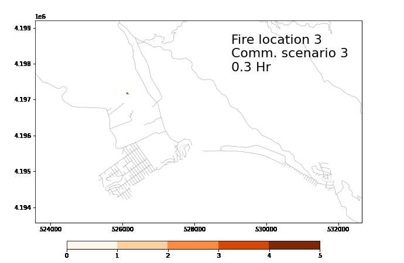

# Spatial Queue Simulator

Simulating traffic flow using spatial-queue-based model.

Modeling evacuation under wildfires.

### Features
* Spatial-queue based mesoscopic traffic simulation
* Collision-free node model (e.g., protected left turns)
* Temporal resolution: 1 second
* Route computation: priority-queue based Dijkstra algorithm [sp](https://github.com/cb-cities/sp). Flexible rerouting frequency
* Compatible with road network retrieved from [OSMnx](https://github.com/gboeing/osmnx)

### Use cases
* Wildfire evacuation: fire-induced road closures, staggered departures, queue spillback and congestion at traffic bottleneck
* Traffic accidents and other non-typical interruptive events
* Technology appriasal: e.g. value of real-time traffic information (GPS penetration rate and accuracy)
* Suitable for network size from a few links to tens of thousands of links (whole county level)

### Getting started
See [the standalone example](projects/bolinas_civic), with the case study in Bolinas, CA.